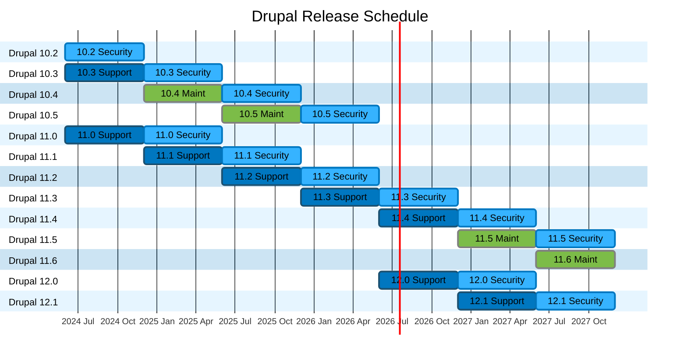

# Drupal Release Schedule

[View it in GitLab](https://git.drupalcode.org/project/drupal/-/blob/11.x/RELEASES.md)

---

### Export graph as image

Copy the mermaid markdown code above:
- Use the `Copy to Clipboard` button when viewing the file via GitLab UI
- Or if you are editing code, copy the mermaid markdown (do not include the wrapping backticks)

Then go to the [Mermaid Live](https://mermaid.live) editor, and paste the code you just copied.
You can see the `Actions` dropdown, and you can click on the `PNG` button to download an export of the graph in PNG format.
